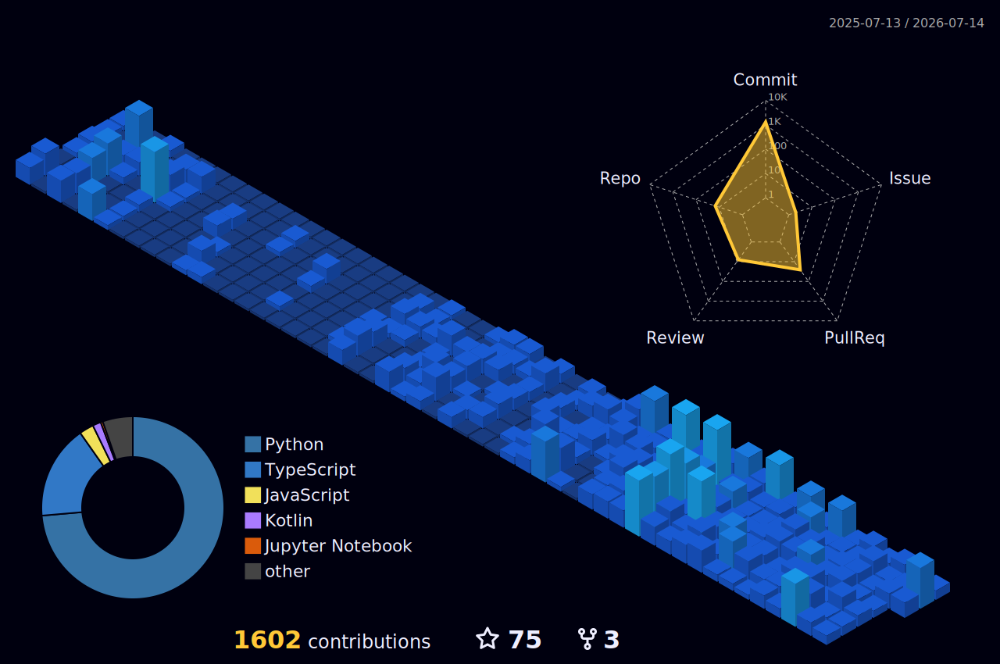

 

 

<b>Based in India · Building with intent</b>

 

  

&nbsp;&nbsp;
&nbsp;&nbsp;
&nbsp;&nbsp;
&nbsp;&nbsp;

  

 

<h2>◈ About ◈</h2>

 

<table style="max-width: 880px; width: 100%;">
  <tr>
    <td style="color: #E8E2D5; background-color: #111116; border-left: 2px solid #C4A24E; padding: 14px 24px;">
      <b>⟫</b>&nbsp; Currently building <b>AI projects</b> — exploring agents, LLMs, and smart automation
    </td>
  </tr>
  <tr>
    <td style="color: #E8E2D5; background-color: #111116; border-left: 2px solid #C4A24E; padding: 14px 24px;">
      <b>⟫</b>&nbsp; Open to collaborating on <b>full-stack projects</b> — especially meaningful tools
    </td>
  </tr>
  <tr>
    <td style="color: #E8E2D5; background-color: #111116; border-left: 2px solid #C4A24E; padding: 14px 24px;">
      <b>⟫</b>&nbsp; Deep diving into <b>Java · React</b> — sharpening the stack
    </td>
  </tr>
  <tr>
    <td style="color: #E8E2D5; background-color: #111116; border-left: 2px solid #C4A24E; padding: 14px 24px;">
      <b>⟫</b>&nbsp; Fluent in <b>JS · Python · ML & AI</b> — building across the stack
    </td>
  </tr>
  <tr>
    <td style="color: #8A8580; background-color: #111116; border-left: 2px solid #C4A24E; padding: 14px 24px;">
      <b>⟫</b>&nbsp; <i>Also: drawing · cooking · puzzles — yes, really</i>
    </td>
  </tr>
</table>

 

<h2>◈ Toolbox ◈</h2>

 

<table style="max-width: 800px;">
  <tr>
    <td style="padding: 6px 10px;"></td>
    <td style="padding: 6px 10px;"></td>
    <td style="padding: 6px 10px;"></td>
    <td style="padding: 6px 10px;"></td>
    <td style="padding: 6px 10px;"></td>
    <td style="padding: 6px 10px;"></td>
    <td style="padding: 6px 10px;"></td>
    <td style="padding: 6px 10px;"></td>
  </tr>
  <tr>
    <td style="padding: 6px 10px;"></td>
    <td style="padding: 6px 10px;"></td>
    <td style="padding: 6px 10px;"></td>
    <td style="padding: 6px 10px;"></td>
    <td style="padding: 6px 10px;"></td>
    <td style="padding: 6px 10px;"></td>
    <td style="padding: 6px 10px;"></td>
    <td style="padding: 6px 10px;"></td>
  </tr>
  <tr>
    <td style="padding: 6px 10px;"></td>
    <td style="padding: 6px 10px;"></td>
    <td style="padding: 6px 10px;"></td>
  </tr>
</table>

 

<h2>◈ GitHub Graph ◈</h2>

 

  

<table width="100%" style="max-width: 880px;">
  <tr>
    <td width="50%" align="center" style="padding: 8px;">
      
    </td>
    <td width="50%" align="center" style="padding: 8px;">
      
    </td>
  </tr>
</table>

 

<table width="100%" style="max-width: 880px;">
  <tr>
    <td width="50%" align="center" style="padding: 8px;">
      
    </td>
    <td width="50%" align="center" style="padding: 8px;">
      
    </td>
  </tr>
</table>

 

 

 

<h2>◈ Recent Writing ◈</h2>

 

  
    
  
    
  

 

<h2>◈ Commit Space Shooter ◈</h2>

 

 

  
<b>◆ Tap for a Surprise ◆</b>

   
  

 

 

  <b>◈ Crafted with ◆ by Ayush Singh ◈</b>
   
  ⟪ full-stack · Ai/Ml · Creative ⟫

 

  

